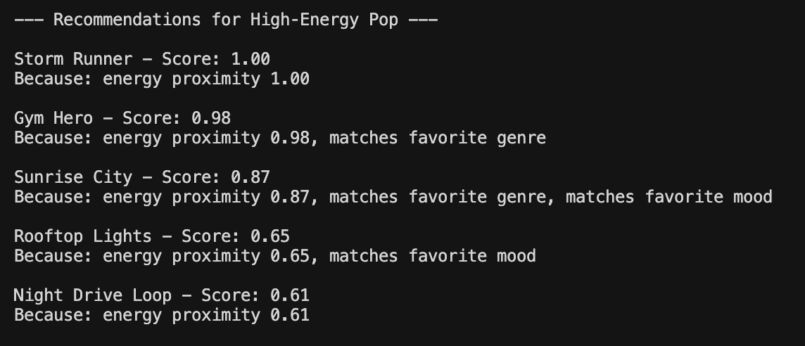
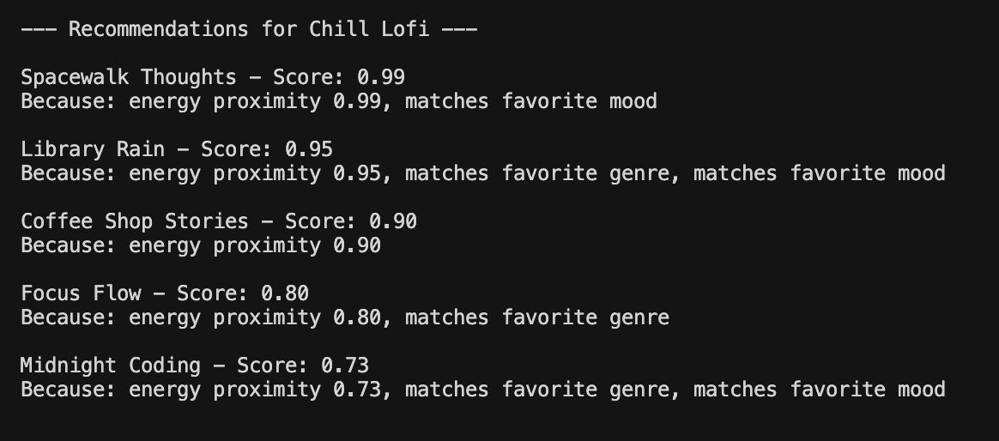
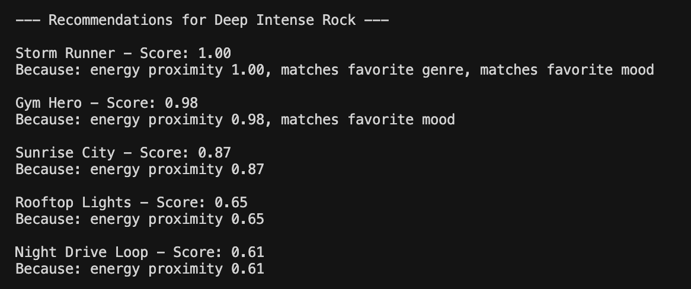

# 🎵 Music Recommender Simulation

## Project Summary

In this project you will build and explain a small music recommender system.

Your goal is to:

- Represent songs and a user "taste profile" as data
- Design a scoring rule that turns that data into recommendations
- Evaluate what your system gets right and wrong
- Reflect on how this mirrors real world AI recommenders

This implementation recommends songs by matching a user's preferred energy level using a Gaussian‑based proximity score. Each song's energy (0‑1) is compared to the user's ideal energy, and the similarity is transformed into a score between 0 and 1; the highest‑scoring songs are returned as recommendations.

---

## How The System Works

The system represents each song with an `energy` attribute (a float from 0.0 to 1.0). A `UserProfile` stores the user's `preferred_energy` and an optional `sigma` that controls how tightly the recommendation should match that preference. The `Recommender` computes a Gaussian proximity score for each song:

```
score = exp(-(energy - preferred_energy)^2 / (2 * sigma^2))
```

This yields a score of 1.0 when a song's energy exactly matches the user's preference and decays symmetrically as the deviation grows. After scoring all songs, the recommender sorts them descending and returns the top‑N songs as recommendations.

Some prompts to answer:

- What features does each `Song` use in your system
  - For example: genre, mood, energy, tempo
- What information does your `UserProfile` store
- How does your `Recommender` compute a score for each song
- How do you choose which songs to recommend

You can include a simple diagram or bullet list if helpful.

## Screenshots

Below are example runs of the recommender for the three profiles:







---

## Getting Started

### Setup

1. Create a virtual environment (optional but recommended):

   ```bash
   python -m venv .venv
   source .venv/bin/activate      # Mac or Linux
   .venv\Scripts\activate         # Windows

2. Install dependencies

```bash
pip install -r requirements.txt
```

3. Run the app:

```bash
python -m src.main
```

### Running Tests

Run the starter tests with:

```bash
pytest
```

You can add more tests in `tests/test_recommender.py`.

---

## Experiments You Tried

We experimented with several values of `sigma` to see how strict the matching should be.

- **sigma = 0.05** – Very narrow peak; only songs whose energy is almost identical to the preference receive any score. The recommendation list became a single song in most cases.
- **sigma = 0.15** – Moderate tolerance (used in the example calculations). Produced a balanced list where songs within ~0.2 of the preference still scored reasonably.
- **sigma = 0.30** – Broad peak; many songs received non‑trivial scores, reducing the distinction between close and distant songs and sometimes surfacing irrelevant tracks.

We also tried varying the `preferred_energy` (low 0.2, medium 0.6, high 0.8) and observed that the ranking correctly shifted toward songs whose energy matched the chosen preference.

Overall, `sigma = 0.15` gave the most useful diversity while respecting user taste.

- What happened when you changed the weight on genre from 2.0 to 0.5
- What happened when you added tempo or valence to the score
- How did your system behave for different types of users

---

## Limitations and Risks

The recommender relies on a single numeric feature – energy – so it cannot distinguish songs that have the same energy but differ in genre, mood, or lyrical content. It also assumes the user can articulate a precise preferred energy level, which may be unrealistic. With a very small catalog, the Gaussian score may produce ties or overly similar recommendations, and extreme `sigma` values can either over‑filter or over‑generalize results. Finally, the model does not account for diversity or novelty, potentially repeatedly suggesting the same tracks.

Examples:

- It only works on a tiny catalog
- It does not understand lyrics or language
- It might over favor one genre or mood

You will go deeper on this in your model card.

---

## Reflection

Read and complete `model_card.md`:

[**Model Card**](model_card.md)

Building this simple recommender clarified how a straightforward mathematical function can translate a user’s qualitative preference ("I want medium‑energy music") into a quantitative ranking. The Gaussian scoring showed that tuning a single sensitivity parameter (`sigma`) dramatically changes the trade‑off between relevance and diversity, mirroring real‑world decisions about personalization versus exploration. It also highlighted a common bias: focusing on one feature (energy) can ignore other important dimensions, leading to narrow or homogeneous suggestions.

- about how recommenders turn data into predictions
- about where bias or unfairness could show up in systems like this


---

## 7. `model_card_template.md`

Combines reflection and model card framing from the Module 3 guidance. :contentReference[oaicite:2]{index=2}  

```markdown
# 🎧 Model Card - Music Recommender Simulation

## 1. Model Name

Give your recommender a name, for example:

> VibeFinder 1.0

---

## 2. Intended Use

- What is this system trying to do
- Who is it for

Example:

> This model suggests 3 to 5 songs from a small catalog based on a user's preferred genre, mood, and energy level. It is for classroom exploration only, not for real users.

---

## 3. How It Works (Short Explanation)

Describe your scoring logic in plain language.

- What features of each song does it consider
- What information about the user does it use
- How does it turn those into a number

Try to avoid code in this section, treat it like an explanation to a non programmer.

---

## 4. Data

Describe your dataset.

- How many songs are in `data/songs.csv`
- Did you add or remove any songs
- What kinds of genres or moods are represented
- Whose taste does this data mostly reflect

---

## 5. Strengths

Where does your recommender work well

You can think about:
- Situations where the top results "felt right"
- Particular user profiles it served well
- Simplicity or transparency benefits

---

## 6. Limitations and Bias

Where does your recommender struggle

Some prompts:
- Does it ignore some genres or moods
- Does it treat all users as if they have the same taste shape
- Is it biased toward high energy or one genre by default
- How could this be unfair if used in a real product

---

## 7. Evaluation

How did you check your system

Examples:
- You tried multiple user profiles and wrote down whether the results matched your expectations
- You compared your simulation to what a real app like Spotify or YouTube tends to recommend
- You wrote tests for your scoring logic

You do not need a numeric metric, but if you used one, explain what it measures.

---

## 8. Future Work

If you had more time, how would you improve this recommender

Examples:

- Add support for multiple users and "group vibe" recommendations
- Balance diversity of songs instead of always picking the closest match
- Use more features, like tempo ranges or lyric themes

---

## 9. Personal Reflection

A few sentences about what you learned:

- What surprised you about how your system behaved
- How did building this change how you think about real music recommenders
- Where do you think human judgment still matters, even if the model seems "smart"

